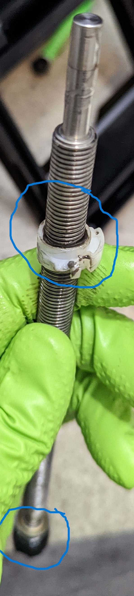
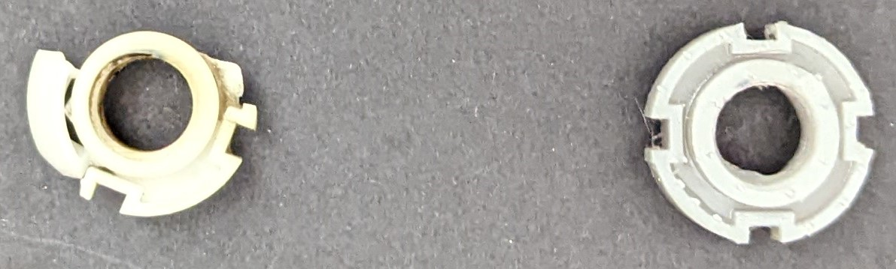

[Skip the introduction and go directly to the fix](#the-fix-and-part-specifications)

## Bought a CoolScan 8000

I recently bought a used Nikon Coolscan 8000 film scanner on eBay. These scanners are old, so much so that Nikon
does not even manufacture them anymore. They were deprecated in early 2000s in favour of Coolscan 9000, and even
9000s are not manufactured anymore! However, 8000 is much cheaper than 9000; while used 9000 go for around
US$3000-5000, whereas used 8000 go for around US$1000-1500.

Given that these scanners are more than 2 decades old, they still have a cult following (check
the [Facebook group](https://www.facebook.com/groups/1514948298527146)).
The reason has to do with the excellent lens, true 4000dpi scanning resolution, 14 bit A/D (analog-to-digital)
converter and, its autofocus mechanism.
---

## The Trouble

Short version, I received a broken piece. Upon turning it on, I could hear some motor noises but the LED power light
did not turn on. Before initiating a return, as eBay allows return of non-working merchandise even if seller stated
that they do not accept return, I decided to open the cover to check if there is anything I can fix quickly.

### LED

Simplest of the fix; it fell out of its socket during the shipping. This was the reason I thought the rest of the
repair will be as easy, that maybe some components got misaligned during shipping. This encouraged me to look at the
other issue. Maybe it was just improper handling that some parts were out of alignment.

### Scanner not detecting the film tray

I saw that the shaft and motor were not touching when I powered on the scanner. I thought that this was another
simple fix, and down the rabbit hole I went...

Here is what I mean:

The upper portion (circled) is the shaft-collar that was broken, and I had to get it 3D printed. The lower portion 
(circled) is the part I thought was misaligned. When I replaced the shaft-collar, I tried to align the two pieces 
together; however, the shaft would slip even with the slightest rotation. Thanks to the amazing community on Facebook; 
I found out that even the coupling is broken. 

After I had replaced these parts, the scanner started working normally. But, as soon as I put the cover back on, the 
same problem showed up. I removed the cover to see maybe I had incorrectly put some component, or forgot to tighten 
a screw. However, as soon as I removed the cover... scanner started working again. I was left scratching my head, 
Turns out, the cover was skewing the whole body to a side. More details in [this section](#spacers) 

---

## The fix and part specifications

I had to 3D print one part, and ordered other parts from McMaster-Carr. I have provided the links for what I
purchased from McMaster-Carr (non-affiliate links i.e I do not get any money from the links). I have provided the
STL file for the missing part which I had to 3-D print.

### Shaft collar (part: TK156-005)
This part is referred as TK156-005 in the Nikon repair manual andI had to 3D print this part. The picture of broken and
whole part are shown side-by-side.

Getting correct measurements was a challenge, but designing on Fusion 360 was fairly easy. You can download
the file as either:

* [Fusion 360](../media/ShaftCollar-TK156-005-CoolScan-8000/ShaftCollar-TK156-005-CoolScan-8000.f3d)
* [STEP](../media/ShaftCollar-TK156-005-CoolScan-8000/ShaftCollar-TK156-005-CoolScan-8000.step) for designing
* [STL](../media/ShaftCollar-TK156-005-CoolScan-8000/ShaftCollar-TK156-005-CoolScan-8000.stl) for 3D printing

### Screws and washers

* Most of the missing screws are [M3x0.5mm of 8mm length](https://www.mcmaster.com/90258A178/) (i.e. 3mm diameter, 
  0.5mm screw pitch, 8mm length)
* Screws for motor are M3x0.5mm with 5mm length; however, I was able to use 8mm long screws
* The external cover and front face also uses [3mm washer](https://www.mcmaster.com/98689A112/)
  and [3mm split-lock washer](https://www.mcmaster.com/92148A150/)

### Motor coupling

I went through a few links given on the Facebook group, and many people had used a single-form coupling. However,
that required that the shafts to be ground in order to fit one straight-edge of the coupling. I did not like the
idea because I was worried that I may grind down too much, and also, I may have to return the scanner. So I used
clamp-style jaw, zero-backlash, vibration-damping motor coupling made of aluminium by
[Ruland](https://www.ruland.com/). These coupling come in three pieces, one hub for the motor shaft, one hub for worm
drive shaft, and a coupling spider and are made in the USA.

These are, however, expensive (around $50) compared to a coupling like uxCell 5mm to 6mm rigid coupling on
[Amazon](https://www.amazon.com/a13052700ux0251-Stepper-Coupling-Coupler-Encoder/dp/B00DCAIRIC) which is
available for around $10.

* The [motor shaft](https://www.mcmaster.com/9845T51-9845T416/) is 6mm diameter, 21.8mm long, 15mm outer diameter
  (Ruland part MJC15-6-A)
* The [worm drive shaft](https://www.mcmaster.com/9845T51-9845T415/) is 5mm in diameter, 21.8mm long, 15mm outer
  diameter (Ruland part MJC15-5-A)
* The [coupling spider](https://www.mcmaster.com/9845T485/) fits in the hubs of these coupling (Ruland part JD10/15-98R)

I am a big fan of McMaster-Carr because of the quality components; Amazon is full of third-party sellers who are
either a hit or miss. While you can return the order for a full refund, it's a hassle to order from another seller if
you didn't receive what you ordered, or if the product fails.

### Slide rails and shaft

Both are made of stainless steel with very smooth finish to enable to LED bulb to slide smoothly over the film.

* Slide rail is 300mm long and 10mm diameter
* The worm-drive shaft is 225mm long and the threads are M10x1.25mm i.e 10mm outer diameter(OD) with 1.25mm pitch
  - 10mm diameter at the widest i.e. the part with threads
  - 6mm diameter at the ends i.e. the part without threads
  - The narrow ends on either side are 2.5cm long

### Spacers

The last issue that remained unresolved was that the scanner stopped detecting tray as soon as I put the cover back 
on! From the Facebook group, I found a comprehensive repair manual for CoolScan 9000, which is one step up from 8000,
however, overall hardware is the same. That document mentioned that there has to be a 1mm gap between backplate and 
the cover. I could not find any such information about 8000 but the spacers are relatively cheap, so I put 2mm 
spacers on the backplate, and this fixed the problem! 
[Link to the spacer I ordered.](https://www.mcmaster.com/92871A102/)

---

## Why a film scanner? Why film photography at all?

The digital cameras have taken over everything. As a hobbyist though, I dislike the idea of taking 100 photos of a
scene with the intention of choosing the good photos later. The "later" part never comes, and I am stuck with
hundreds of photos where I can't decide which ones to keep and which ones to delete.

Since photography is a hobby for me, I like to a take leisurely approach and deliberate about each photo before
pressing the button. That, however, does not work when I am shooting digital; I feel compelled to keep taking
pictures lest I may miss a great shot. Film cameras, force me to slow down. There is no 4 frames/second of shoot
mode, no auto-bracketing, and not even a built-in light meter.

On top of it, the quality of photos is hard to beat. I use medium-format film camera and the potential resolution of
these 120mm films is no match for run-of-the-mill digital cameras. You have to shell out a minimum of US$10,000 to
get similar digital camera; and they are bulky to carry around.
 

## Finishing thoughts

All in all, I am satisfied with the scanner, but not satisfied with the purchase. I wanted a working scanner, but it 
turned out to be a project in itself to get it to working condition. I learnt about 3D printing and CAD design, that 
is a blessing in disguise. However, I had paid extra money to get a working scanner, and it's frustrating to receive
a non-working scanner when it was advertised as working. In fairness, the seller has agreed to reimburse the cost 
and a little extra for the trouble. I have sent him all the things I had to purchase to fix the scanner, and I am 
yet to hear back on my message. I will keep my fingers crossed and in the meantime, next project is to calibrate the 
scanner with a standard IT8 colour profile.
